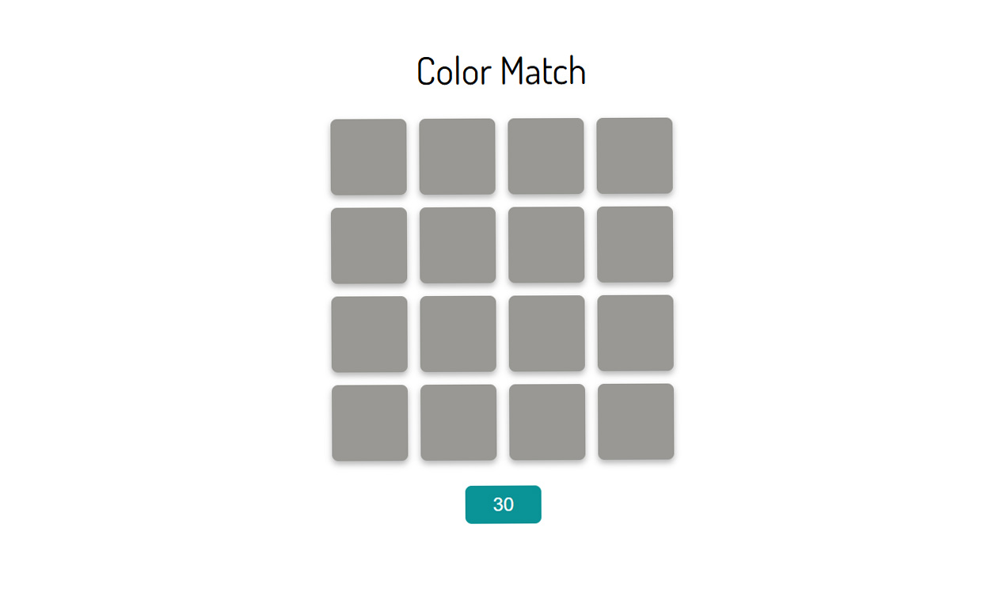
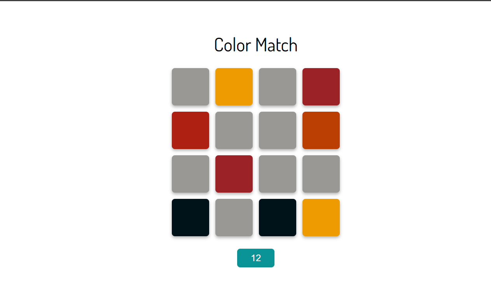
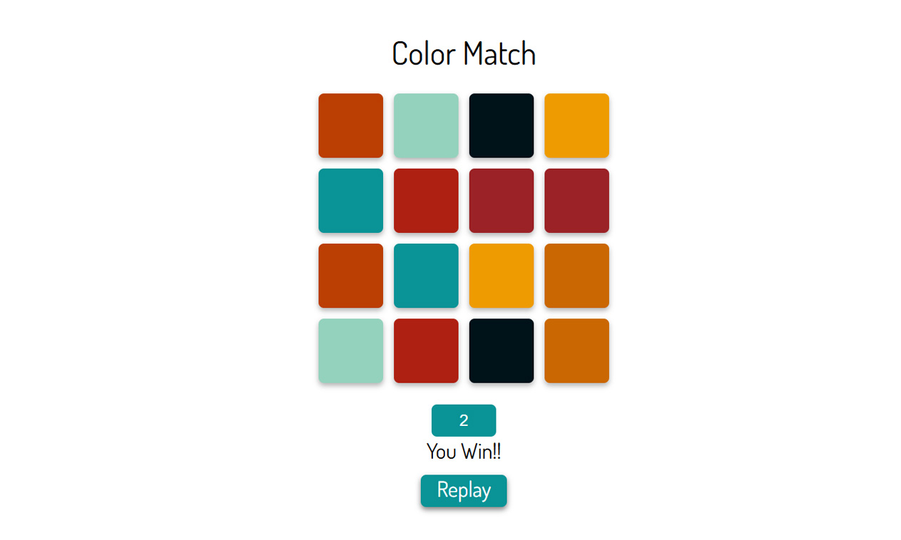

## View Here
https://emilyamartin.github.io/Color-Matching-Game/

## Project Overview
Colour Matching is a game I developed to refine my skills in working with grids and arrays. The objective is to identify all matching color pairs within a 30-second time limit. To increase the challenge, I selected a color palette with subtle variations, making it more difficult to distinguish between similar hues. The 30-second timer encourages quick decision-making and adds an element of urgency. Best of luck!

## Motivation
The motivation behind this project stemmed from my desire to explore the use of grids and arrays within a JavaScript application. Growing up, I was always drawn to fast-paced games like Perfection, where quick decision-making was needed. I wanted to create a simple game that captured a similar sense of urgency and challenge.

## Technology Stack
Languages - HTML/CSS/JavaScript

## Credits
My coach, Matthew Vey, provided incredible support throughout the development of this project. After we completed our first project together, he encouraged me to expand on knowledge of JavaScript by exploring grids and arrays. His guidance and encouragement were so helpful and allowed me to succeed with this project.

## Preview

